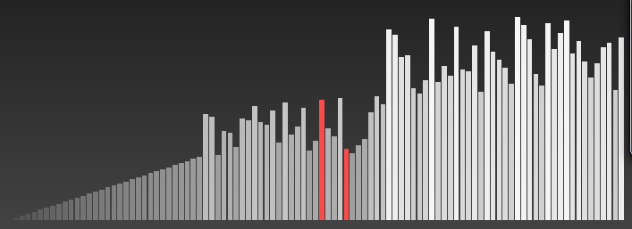

# Sorting Visualizer


Sorting Visualizer adalah program yang memvisualisasikan algoritma sorting menggunakan SFML di C++. Program ini menampilkan bar yang bergerak sesuai dengan algoritma sorting yang diterapkan.

## Algoritma Sorting yang Digunakan

Algoritma yang digunakan dalam visualisasi ini adalah **Bubble Sort**. Berikut adalah cara kerja Bubble Sort:

1. Bandingkan dua elemen berdekatan dalam array.
2. Jika elemen pertama lebih besar dari elemen kedua, tukar posisi keduanya.
3. Ulangi langkah 1 dan 2 untuk seluruh array.
4. Setelah setiap iterasi, elemen terbesar akan berpindah ke posisi akhirnya.
5. Proses berlanjut hingga seluruh array tersortir.

## Package yang Digunakan

Program ini menggunakan **SFML (Simple and Fast Multimedia Library)** untuk menggambar grafis dan menghasilkan suara. Berikut adalah package yang digunakan:

- `sfml-graphics`
- `sfml-window`
- `sfml-system`
- `sfml-audio`
- `openal-soft` (untuk audio)

## Setup di macOS

1. **Install Homebrew (jika belum ada):**
   ```sh
   /bin/bash -c "$(curl -fsSL https://raw.githubusercontent.com/Homebrew/install/HEAD/install.sh)"
   ```

2. **Install SFML:**
   ```sh
   brew install sfml@2 openal-soft
   ```

3. **Pastikan package SFML terinstall dengan benar:**
   ```sh
   pkg-config --modversion sfml-graphics sfml-audio
   ```
   Jika berhasil, akan menampilkan versi SFML yang terinstall.

4. **Tambahkan OpenAL ke `PKG_CONFIG_PATH`:**
   ```sh
   export PKG_CONFIG_PATH="/usr/local/Cellar/openal-soft/1.24.2/lib/pkgconfig:$PKG_CONFIG_PATH"
   ```

## Cara Kompilasi

Untuk mengkompilasi program, jalankan perintah berikut:
```sh
g++ -std=c++17 -o sorting_visualizer src/main.cpp $(pkg-config --cflags --libs sfml-graphics sfml-window sfml-system sfml-audio) -lpthread
```

## Cara Menjalankan

1. **Pastikan file `beep.wav` berada dalam folder `src` berdampingan dengan `main.cpp`**.
2. **Jalankan program menggunakan perintah berikut:**
   ```sh
   ./sorting_visualizer
   ```

Setelah dijalankan, akan muncul jendela visualisasi sorting dengan bilah yang bergerak sesuai dengan algoritma sorting yang diterapkan.

## Catatan
- Jika terjadi error terkait `openal`, pastikan `PKG_CONFIG_PATH` telah diatur dengan benar.
- Jika `beep.wav` tidak berbunyi, pastikan file tersebut ada dalam direktori yang benar dan dapat diakses oleh program.

## Lisensi
Proyek ini menggunakan lisensi MIT. Anda bebas menggunakannya untuk tujuan pribadi maupun komersial.

